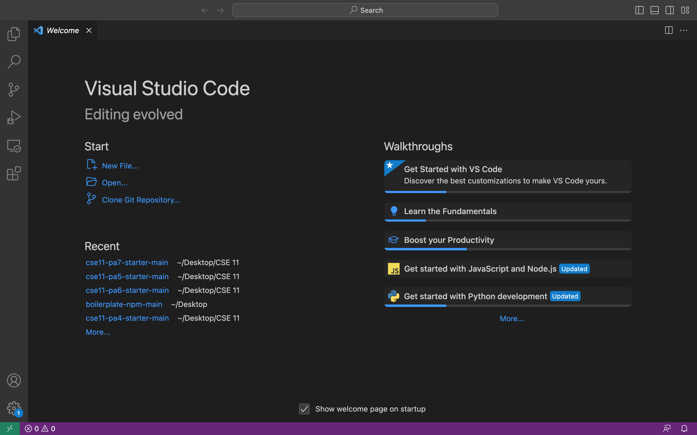
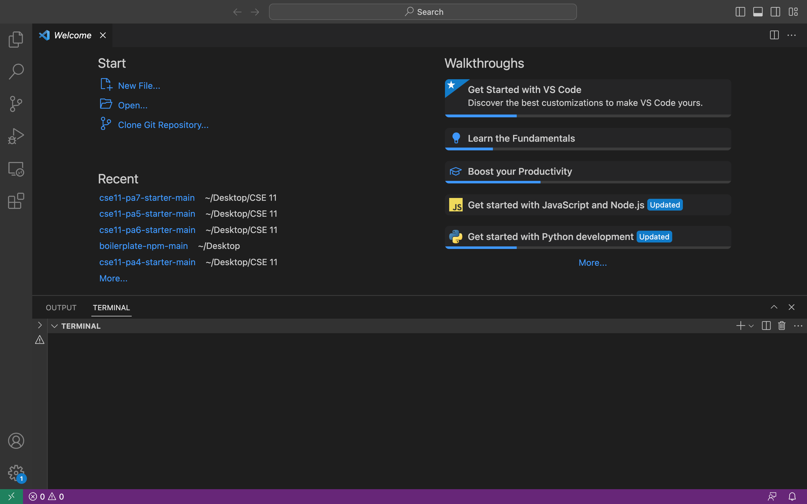
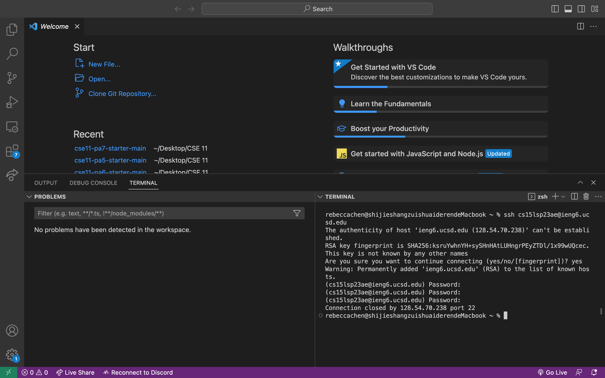
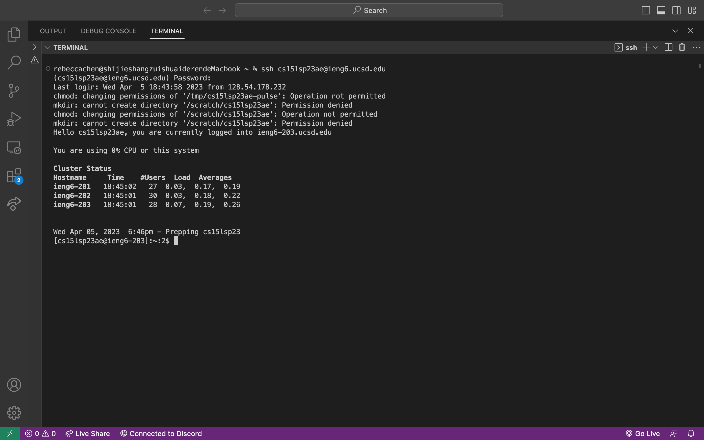
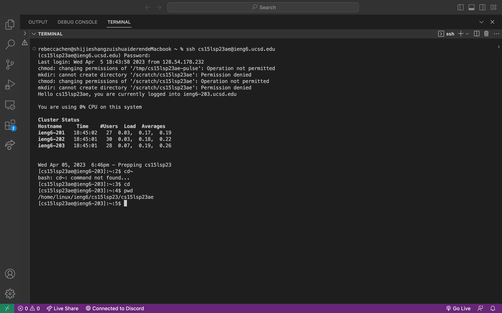
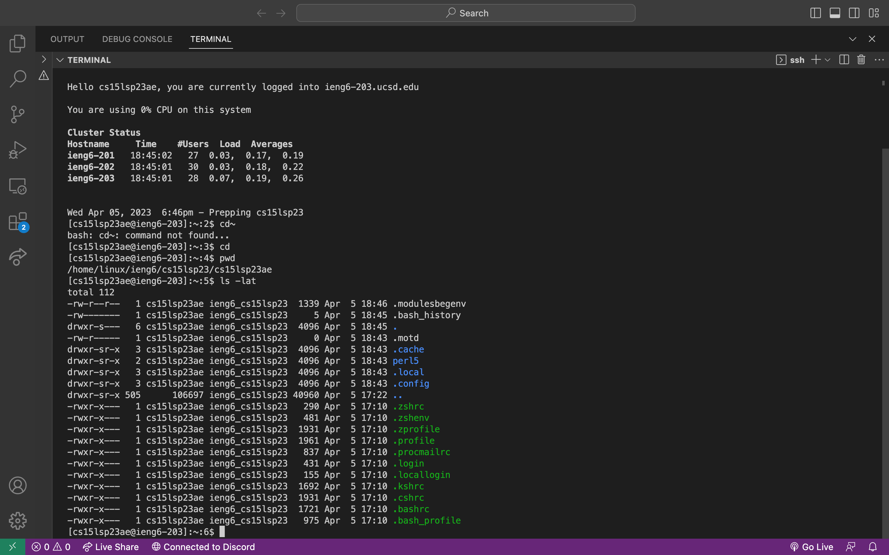
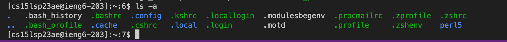

# CSE 15L lab report 1 (Week 1)

## Contents 
* [Step 1: Using terminal within VS Code](#step-1-using-terminal-within-vs-code)
* [Step 2: Remote access your account](#step-2-Remote-access-your-account)
* [Step 3: Try some commands!](#step-3-Try-Some-Commands)


## Step 1: Using terminal within VS Code

* Since I already have VS Code installed, I open VS Code and open a new terminal. 


* Go to terminal > new terminal. Now a new terminal is opened. 


## Step 2: Remote access my account

I used the following command to connect to my account, and then received the following prompt:
  
  ```$ ssh cs15lsp23ae@ieng6.ucsd.edu```
  
 My first try in connecting was unsuccessful beacuse I typed in the wrong passwords. The second time logging in, I got the resulting correct prompt. 
  
  

  
  ✅ I am now successfully connected to a computer in the CSE basement. 
  
## Step 3: Try Some Commands
I tried several interesting commands. 
First, the ```cd~``` command. Interestingly it gives me "command not found"; Now I try ```cd```, and ```pwd``` to list current working directory. 
  

Then, I tried ```ls -lat``` . This command lists all files and directories in the current directory, and it gave me some interesting results. 
  
  
  Finally, I tried the ```ls -a``` command. Different from the previous command, this one doesn't show any additional information (file permission, size, etc.) 
 
